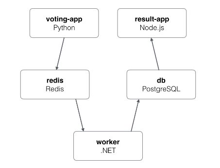

# vstakd
This repository contains instruction for setting up K8s cluster and setting up CI &amp; CD pipeline on top of it

## Overview
This is my personal project where I am trying to setup Jenkins Pipeline for web application on top of Kubernetes Cluster

### Components - tools
1. Cloud - AWS, AWSCLI, AWS IAM Authentication
2. Kubernetes Cluster - kubectl, eksctl, istio
3. Jenkins - Helm Charts
4. Pipeline - Jenkins Shared Library
5. Web Application - Voting App (5 tier application)

### Repos & Charts
|     App Name      |                              App Link                              | App Branch |                                       Chart                                       | Chart Branch |                                Comment                                |
| :---------------: | :----------------------------------------------------------------: | :--------: | :-------------------------------------------------------------------------------: | :----------: | :-------------------------------------------------------------------: |
|  voting-app-vote  | [voting-app-vote](https://github.com/dhavlev/voting-app-vote.git)  |   master   |  [chart](https://github.com/dhavlev/helm-charts/tree/voting-app/voting-app-vote)  |  voting-app  |              web application responsible recording vote               |
| voting-app-result | [voting-app-result](https://github.com/dhavlev/voting-app-result)  |   master   | [Chart](https://github.com/dhavlev/helm-charts/tree/voting-app/voting-app-result) |  voting-app  |              web application responsible showing results              |
| voting-app-worker | [voting-app-worker ](https://github.com/dhavlev/voting-app-worker) |   master   | [chart](https://github.com/dhavlev/helm-charts/tree/voting-app/voting-app-worker) |  voting-app  | worker application, read data from redis cache and writes to database |
| voting-app-redis  |  [voting-app-redis](https://github.com/dhavlev/voting-app-redis)   |   master   | [chart](https://github.com/dhavlev/helm-charts/tree/voting-app/voting-app-redis)  |  voting-app  |  contains Jenkinsfile responsible for calling helm charts for redis   |
|   voting-app-db   |       [voting-app](https://github.com/dhavlev/voting-app-db)       |   master   |   [chart](https://github.com/dhavlev/helm-charts/tree/voting-app/voting-app-db)   |  voting-app  | contains Jenkinsfile responsible for calling helm charts for database |

### Pre-requisites 1 - Setting up Core Components
1. Install AWSCLI
2. Install AWS IAM Authentication
3. Install kubectl
4. Install eksctl

### Pre-requisites 2 - Preparing environment to host Web Application
1. Install Helm
2. Install Istio
3. Install Jenkins

### Pre-requisites 3 - Secrets creation for CI and CD
|     Secret Name      |                    Command                    |                                                Comment                                                |
| :------------------: | :-------------------------------------------: | :---------------------------------------------------------------------------------------------------: |
| docker-config-secret | [docker-config-secret](#docker-config-secret) |              Please make sure you pass correct credential for creation of docker secret               |
|     kube-secret      |          [kube-secret](#kube-secret)          | In the command 'kube-secret' is file which contains kube config of a user who can talk to k8s cluster |

### Pre-requisites 4 - Preparing Jenkins
1. Configure global shared library - Jenkins Shared Library 
1. Create Pipeline - db
2. Create Pipeline - redis
3. Create Pipeline - Worker
4. Create Pipeline - Vote
5. Create Pipeline - Result

### Action
1. Pipeline responsible for CI and builds docker image and stored in docker hub account
2. Deployment happers based on configuration in Jenkinsfile choosing appropriate helm charts for deployment

### Commands
#### docker-config-secret
kubectl create secret docker-registry docker-config-secret --docker-server=https://index.docker.io/v1/ --docker-username=your-username --docker-password=your-password --docker-email=my-email@provider.com

#### kube-secret
kubectl create secret generic kube-secret --from-file=config=kube-secret