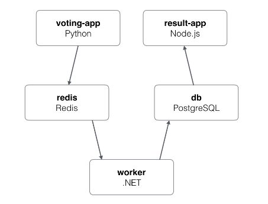

# vstakd
This repository contains instruction for setting up K8s cluster and setting up CI &amp; CD pipeline on top of it.


## Overview
This is my personal project where I am trying to setup Jenkins Pipeline for web application on top of Kubernetes Cluster.



### Components - tools
1. Cloud - AWS, AWSCLI, AWS IAM Authentication
2. Kubernetes Cluster - kubectl, eksctl, istio
3. Orchestration/CI-CD - Jenkins
4. Pipeline - Jenkins Shared Library
5. Web Application - Voting App (5 tier application)
6. Tracing - Zipkin
7. Observability - Kiali

### Repos & Charts
|     App Name      |                              App Repo                              | App Branch |                                    Helm Chart                                     | Chart Branch |                                Comment                                |
| :---------------: | :----------------------------------------------------------------: | :--------: | :-------------------------------------------------------------------------------: | :----------: | :-------------------------------------------------------------------: |
|  voting-app-vote  | [voting-app-vote](https://github.com/dhavlev/voting-app-vote.git)  |   master   |  [chart](https://github.com/dhavlev/helm-charts/tree/voting-app/voting-app-vote)  |  voting-app  |              web application responsible recording vote               |
| voting-app-result | [voting-app-result](https://github.com/dhavlev/voting-app-result)  |   master   | [Chart](https://github.com/dhavlev/helm-charts/tree/voting-app/voting-app-result) |  voting-app  |              web application responsible showing results              |
| voting-app-worker | [voting-app-worker ](https://github.com/dhavlev/voting-app-worker) |   master   | [chart](https://github.com/dhavlev/helm-charts/tree/voting-app/voting-app-worker) |  voting-app  | worker application, read data from redis cache and writes to database |
| voting-app-redis  |  [voting-app-redis](https://github.com/dhavlev/voting-app-redis)   |   master   | [chart](https://github.com/dhavlev/helm-charts/tree/voting-app/voting-app-redis)  |  voting-app  |  contains Jenkinsfile responsible for calling helm charts for redis   |
|   voting-app-db   |     [voting-app-db](https://github.com/dhavlev/voting-app-db)      |   master   |   [chart](https://github.com/dhavlev/helm-charts/tree/voting-app/voting-app-db)   |  voting-app  | contains Jenkinsfile responsible for calling helm charts for database |

### Setup 1 [pre1.sh](pre1.sh)
Steps:
1. System update
2. Kubectl installation
3. Aws iam authentication installation
4. Istio installation
5. Aws cli setup
6. Configure aws profile
   
```
chmod 777 pre1.sh
./pre1.sh
``` 
### Setup 2 - [pre2.sh](pre2.sh)
Steps:
1. Creation of EKS cluster
2. Helm installation
3. Instio setup
4. Ingress-nginx setup
5. Jenkins setup
6. Kiali ingress setup
7. Zipkin ingress setup
8. Secrets - kube-secret and aws-secret
9. Setup Gateway and Virtual service
    
```
chmod 777 pre2.sh
./pre2.sh
``` 
> Please amend docker credentials in [pre2.sh](pre2.sh)

### Setup 3
1. Browse Jenkins using ingress url [nginx-ingress](#nginx-ingress)
2. Get the password [jenkins-password](#jenkins-password)
3. Configure global shared library 
   Repo - [jenkins-shared-library](https://github.com/dhavlev/jenkins-shared-library/tree/voting-app)
   [Screenshot](images/jenkins-shared-library-configuration.PNG)
4. Make sure [kube-secret](#kube-secret), [aws-secret](#aws-secret) and [docker-config-secret](#docker-config-secret) are created
4. Create Pipeline - db
5. Create Pipeline - redis
6. Create Pipeline - Vote
7. Create Pipeline - Result
8. Create Pipeline - Worker

### Screenshots
1. Configuring 1st pipeline [image](images/jenkins-create-pipeline.PNG)
2. Viewing Jenkins pipelines [image](images/jenkins-3.PNG)
3. Configuring Global Shared Library [image](images/jenkins-3.PNG)
4. Viewing installed applications [image](images/voting-app.PNG)
5. Observe your Istio service mesh using Kiali [image](images/kiali.PNG)
6. Viewing tracing using Zipkin [image](images/zipkin.PNG)

### Commands
#### docker-config-secret
```
kubectl create secret docker-registry docker-config-secret --docker-server=https://index.docker.io/v1/ --docker-username=your-username --docker-password=your-password --docker-email=my-email@provider.com --namespace tooling
```

#### kube-secret
```
kubectl create secret generic kube-secret --from-file=config=kube-secret --namespace tooling
```

#### aws-secret
```
kubectl create secret generic aws-secret --from-file=config=.aws/config --from-file=credentials=.aws/credentials --namespace tooling
```

#### nginx-ingress
```
echo $(kubectl get svc ingress-nginx-ingress-controller -n ingress -o jsonpath='{ .status.loadBalancer.ingress[0].hostname }')
```
#### istio-ingress
```
echo $(kubectl get svc istio-ingressgateway -n istio-system -o jsonpath='{ .status.loadBalancer.ingress[0].hostname }')
```

#### jenkins-password
```
printf $(kubectl get secret --namespace tooling my-jenkins -o jsonpath="{.data.jenkins-admin-password}" | base64 --decode);echo
```

### Troubleshooting
1. Unable to schedule jenkins slave - Make sure k8s secrets are in place for both docker and kube config